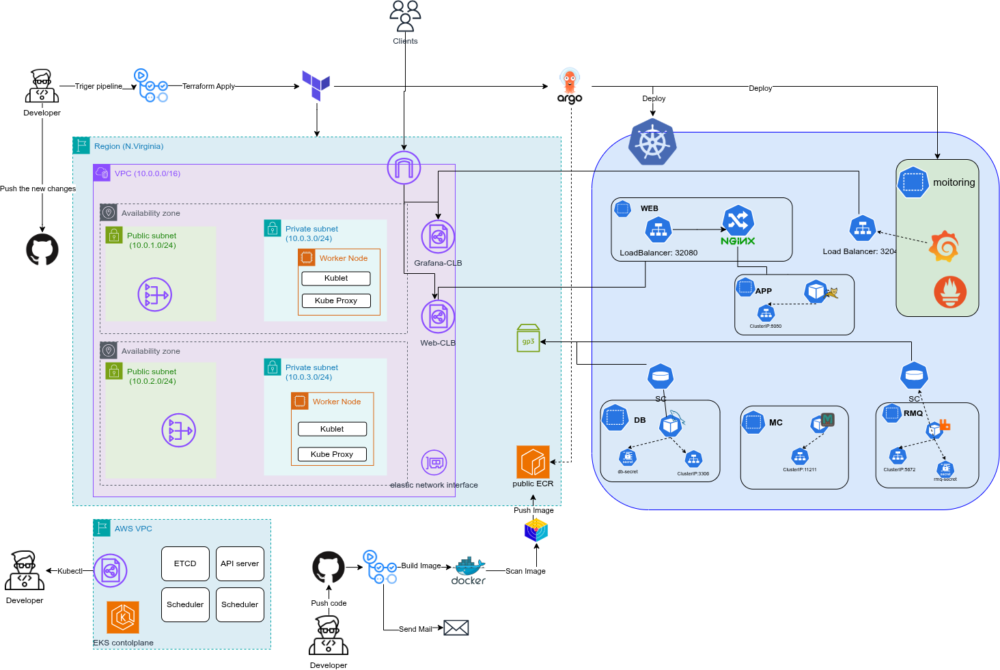
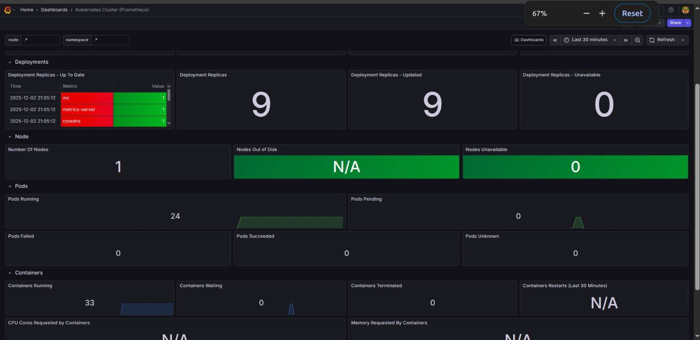
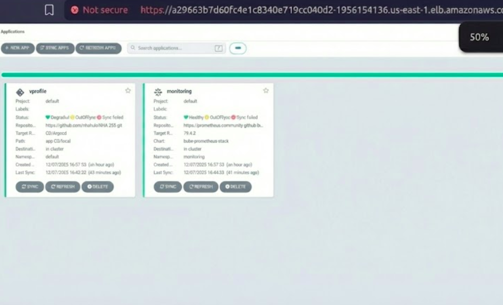

# EFE Capstone Project

This repository contains the source code, deployment manifests, and infrastructure configuration for the VProfile application.

## Components

The project is organized into the following directories:

- **[Application-CI](./Application-CI/README.md)**: Contains the Java application source code and Docker build configuration.
- **[Application-CD](./Application-CD/README.md)**: Contains the Kubernetes manifests for deploying the application using Kustomize.
- **[Terrafrom](./Terrafrom/README.md)**: Contains the Terraform configuration for provisioning AWS infrastructure.

## Getting Started

Please refer to the README files in each subdirectory for detailed instructions on how to build, deploy, and provision the respective components.

## Architecture 

### Monitoring

### ArgoCD

